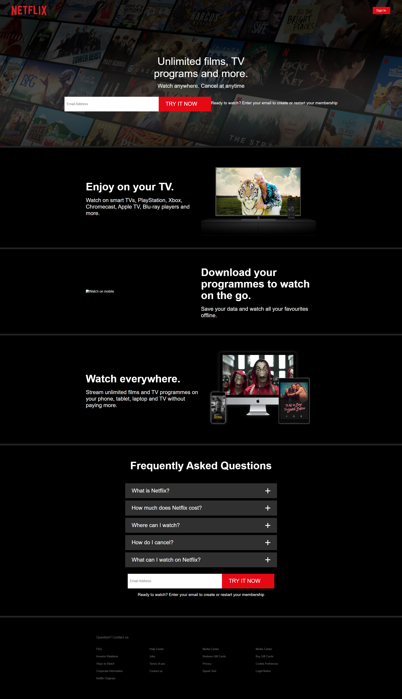

# Netflix Clone App

A netflix clone App that used React, Router Dom


## Screenshots




## Demo

Insert gif or link to demo


## Tech Stack

**Client:** React, Redux

**Server:** Node


## Lessons Learned

What did you learn while building this project? What challenges did you face and how did you overcome them?


## Deployment

To deploy this project run

```bash
  npm run deploy
```


## Features

- Light/dark mode toggle
- Live previews
- Fullscreen mode
- Cross platform


